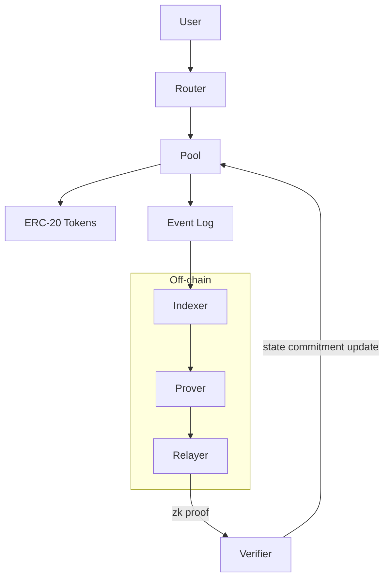

# zk_dex

A zero-knowledge-enabled decentralized exchange protocol for on-chain atomic settlement with optional zk-batched state transitions.

  

---

## Table of Contents

- [Overview](#overview)
- [Key Features](#key-features)
- [Tech Stack](#tech-stack)
- [Protocol Architecture](#protocol-architecture)
- [Execution Pipeline](#execution-pipeline)
- [Core Subsystems](#core-subsystems)
- [Key Design Decisions](#key-design-decisions)
- [Project Structure](#project-structure)
- [Getting Started](#getting-started)
- [Security Considerations](#security-considerations)
- [Future Improvements](#future-improvements)

---

## Overview

`zk_dex` is a smart-contract-first DEX where canonical state and final settlement live entirely on-chain, while heavy computation and optional privacy transformations are handled off-chain and attested via succinct proofs.

The protocol separates concerns into two layers: an on-chain settlement layer (AMM pools, factory registry, router) that is always auditable and trustless, and an optional off-chain proof layer (prover, relayer) that can batch or privatize state transitions without changing the on-chain security model.

---

## Key Features

- Factory/Pool/Router pattern for permissionless liquidity pool deployment and multi-hop swaps
- Atomic on-chain swap settlement with slippage enforcement
- TWAP price accumulators for manipulation-resistant oracle data
- Optional zk-batch settlement via a Verifier contract — state commitment updated via succinct proofs
- Role-based access control with timelock for protocol parameter changes
- Events-first design for efficient off-chain indexing

---

## Tech Stack

| Category | Technology |
|---|---|
| Smart Contracts | Solidity (EVM) |
| Build & Test | Foundry (Forge, Anvil) |
| Off-chain Services | Node.js (indexer, relayer) |
| ZK Proving (planned) | circom / snarkjs or PLONK/Halo2 stack |
| Frontend (planned) | React / Next.js |

---

## Protocol Architecture



**On-chain components** (always active):

| Contract | Responsibility |
|---|---|
| `Factory` | Deploys and registers liquidity pools; maps `(tokenA, tokenB) → poolAddress` |
| `Pool` | Holds reserves, enforces AMM invariant, emits events for all state changes |
| `Router` | User-facing entry point; composes multi-hop paths, validates slippage and deadlines |
| `Verifier` | Accepts zk proofs attesting to valid state transitions; updates on-chain Merkle root |

**Off-chain components** (optional for zk batch flow):

| Component | Responsibility |
|---|---|
| `Indexer` | Listens to events; builds state for UI or proof inputs |
| `Prover` | Generates zk witnesses and proofs from batched transactions |
| `Relayer` | Submits aggregate proofs to Verifier for on-chain finalization |

---

## Execution Pipeline

### Standard Swap

1. User calls `Router.swap()` with path, deadline, and slippage bounds
2. Router validates calldata and resolves the hop path across pools
3. Each `Pool` executes atomically: updates reserves, transfers tokens via `SafeERC20`, emits `Swap` event
4. Off-chain indexer picks up events and updates UI state

### ZK-Batched Settlement (planned)

1. Indexer collects N swap transactions and builds a proof witness
2. Prover generates a succinct proof that attests: `rootBefore + validTransitions → rootAfter`
3. Relayer submits proof to `Verifier` contract
4. `Verifier` confirms the proof and updates the on-chain state commitment
5. Batched changes are finalized; settlement tokens minted/burned accordingly

> On-chain functions are atomic within a single transaction. Cross-transaction batching is only finalized after the `Verifier` accepts a valid proof and updates the Merkle root.

---

## Core Subsystems

### Pool
Stores minimal canonical state: `reserve0`, `reserve1`, cumulative price accumulators (TWAP), fee parameters, and a nonce for replay protection. The AMM invariant (`k = x * y` or equivalent) is enforced on every state transition.

### Factory
Maintains a `mapping(address tokenA => mapping(address tokenB => address pool))` for deterministic pool discovery. Pools are deployed via `CREATE2` for pre-computable addresses.

### Router
Handles path resolution and multi-hop composition. Enforces deadline and minimum output constraints. Does not hold token balances — all transfers route through Pool contracts directly.

### Verifier (planned)
Accepts a proof and two state roots (`rootBefore`, `rootAfter`). Validates the proof against a verifying key embedded at deploy time. Does not interpret what the transition contains — only that it is valid under the circuit constraints.

### Access Control
Small-surface ACL: `owner/governor` for parameter updates, optional timelock for sensitive changes. All mutative functions are gated; read functions remain public.

---

## Key Design Decisions

**Final settlement always on-chain.** The Pool contracts are the canonical source of truth. The optional zk layer cannot modify balances without an on-chain proof acceptance — it has no privileged write path.

**ZK layer is additive, not required.** The protocol works as a standard AMM without a prover or relayer. The Verifier contract is an optional extension that enables gas reduction via batching or future privacy features without changing the base protocol's security model.

**Minimal privileged surface.** Governance actions that change fee parameters or upgrade contracts are restricted to a timelocked multisig. Emergency controls exist but are scoped narrowly.

**Events as first-class citizens.** Every state transition emits structured events. The off-chain indexer is the only consumer of these; the on-chain protocol does not depend on any off-chain state being correct.

---

## Project Structure

```
src/
  Factory/       # pool deployment and registry
  Pool/          # AMM reserve logic, swap/mint/burn
  Router/        # path composition, slippage enforcement
  Verifier/      # zk proof verifier (planned)
  Oracle/        # TWAP and price feed interfaces

offchain/
  indexer/       # event listener, state builder
  relayer/       # proof submission to Verifier
  prover/        # zk circuit + witness generation (planned)

test/
  unit/          # per-contract isolated tests
  integration/   # multi-contract flow tests
  invariant/     # property-based AMM invariant checks
```

---

## Getting Started

### Requirements

- [Foundry](https://getfoundry.sh/)
- Node.js + pnpm (for off-chain tools and frontend)
- Docker (optional, for prover toolchain)

### Build

```shell
forge build
```

### Test

```shell
forge test
forge test --match-contract Pool   # pool-specific tests only
forge snapshot                      # gas benchmarks
```

### Local Deployment

```shell
anvil                                           # start local node
forge script script/Deploy.s.sol --broadcast   # deploy contracts
```

---

## Security Considerations

**Reentrancy.** Checks-effects-interactions pattern enforced on all external token flows. `SafeERC20` used throughout.

**ZK trust assumptions.** Proof verification reduces on-chain computation but introduces trust in circuit correctness. A bug in the circuit could allow invalid state transitions to pass verification. Circuit tests and formal verification are planned before any zk module goes to mainnet.

**Oracle manipulation.** TWAP accumulators reduce spot-price manipulation risk. Governance-controlled parameters (fee, weights) are timelocked.

**Access control.** Mutative admin functions require explicit role checks. No function has an implicit trust path — the Verifier cannot update state without a valid proof, even if called by the owner.

---

## Future Improvements

- Formalize zk circuit design and integrate prover pipeline end-to-end
- Gas-optimized pool variants (e.g., concentrated liquidity, stable swap invariant)
- Meta-transaction support for gas abstraction
- On-chain oracle aggregation for front-running resistance
- Formal verification of AMM invariant and share-math properties
- Full invariant fuzz suite for Pool reserve conservation

---

## License

MIT — see `LICENSE`.